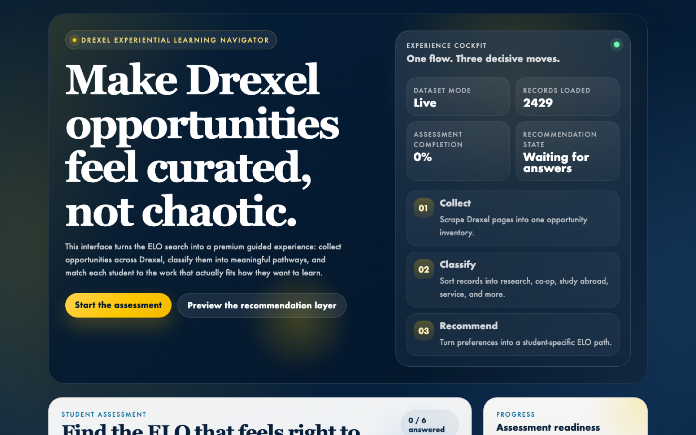
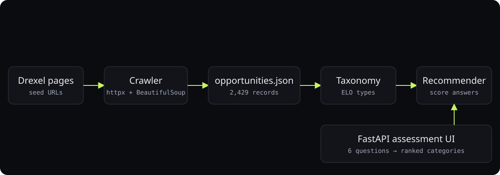
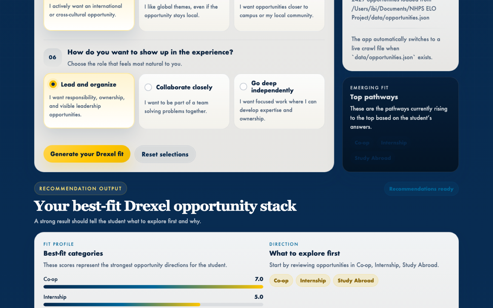

<div align="center">



# Drexel ELO Recommender

**Crawls Drexel, classifies 2,429 experiential-learning opportunities, and recommends a path from a six-question assessment.**

<p>
<a href="https://ibiraheel.com/p/nhps-elo"></a>
</p>

<p>


</p>

</div>

<br>

> **2,429 opportunities crawled and classified**  
> for Drexel students choosing between co-op, research, study abroad, and service

## What it did

A crawler walks Drexel pages into one inventory, a taxonomy layer sorts records into ELO types, and a scoring engine turns six answers into ranked categories and matching records. Live dataset loaded; runs as a FastAPI app.

<sub>Outcome: measured.</sub>

## How it works

<p align="center"></p>

1. Crawler, taxonomy, and recommender are separate modules with a JSON contract between them.
2. Keyword taxonomy for first-pass classification keeps the pipeline deterministic and free.
3. Assessment answers are scored against category weights, then records are ranked within the top categories.
4. The API reports whether it is serving demo or live data so nobody mistakes synthetic records for real ones.

## Screenshots

<table>
<tr>
<td width="50%"><br><sub>Recommendation output: best-fit categories and ranked opportunities</sub></td>
</tr>
</table>

## What is included

- A domain model for opportunities and assessment questions.
- A crawler that can traverse Drexel pages, extract candidate opportunity records, and write them to JSON.
- A keyword-based taxonomy layer for first-pass categorization.
- A recommendation engine that scores assessment answers against available opportunities.
- A FastAPI app with a browser-based assessment UI.

## Important limitation

The workspace currently has no live Drexel dataset, and network access is restricted in this environment. Because of that:

- `data/opportunities.demo.json` contains synthetic demo records so the assessment UI works immediately.
- The live crawler is implemented, but you will need network access and current Drexel seed URLs to populate `data/opportunities.json`.

## Quick start

Create a virtual environment, install dependencies, and run the app:

```bash
python3 -m venv .venv
source .venv/bin/activate
pip install -e .
uvicorn elo_recommender.api:app --reload
```

Then open `http://127.0.0.1:8000`.

## Crawl Drexel pages

This command starts from the default Drexel homepage seed and writes normalized records to `data/opportunities.json`:

```bash
python3 -m elo_recommender.scraper --max-pages 150 --max-depth 3
```

Useful options:

```bash
python3 -m elo_recommender.scraper \
  --seed https://drexel.edu/ \
  --seed https://drexel.edu/academics/ \
  --seed https://drexel.edu/studentlife/ \
  --max-pages 250 \
  --max-depth 4 \
  --output data/opportunities.json
```

## API endpoints

- `GET /api/dataset` shows whether the app is using demo or live data.
- `GET /api/questions` returns the assessment questions.
- `GET /api/opportunities` lists the current opportunity dataset.
- `POST /api/recommendations` accepts assessment answers and returns ranked category and opportunity matches.

Example recommendation request:

```json
{
  "answers": {
    "experience_style": "discovery_lab",
    "desired_outcome": "academic_depth",
    "structure_preference": "mentor_project",
    "compensation_importance": "not_required",
    "global_interest": "yes_high",
    "impact_style": "lead_change"
  }
}
```

## Suggested next build steps

- Replace heuristic extraction with page templates or an LLM-assisted classifier for higher precision.
- Add a reviewer workflow so staff can approve scraped opportunities before publishing.
- Expand the assessment to recommend by major, year, availability, GPA rules, and required prerequisites.

---

<div align="center">

<sub>Built by <a href="https://github.com/ibi-raheel">Muhammad Ibrahim Raheel</a> · more work at <a href="https://ibiraheel.com">ibiraheel.com</a></sub>

</div>
